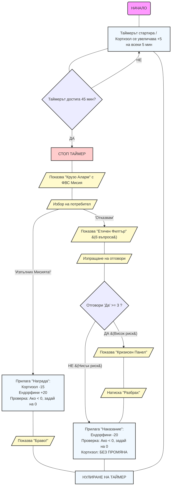

```mermaid
graph TD
    %% Дефиниции на цветовете
    classDef startEnd fill:#f9f,stroke:#333,stroke-width:2px;
    classDef function fill:#f0f8ff,stroke:#333,stroke-width:2px;
    classDef io fill:#fffacd,stroke:#333,stroke-width:2px;
    classDef condition fill:#lightgreen,stroke:#333,stroke-width:2px;
    classDef stop fill:#ffcccc,stroke:#333,stroke-width:2px;
    %% Начало
    A(НАЧАЛО) --- B[Таймерът стартира / Кортизол се увеличава +5 на всеки 5 мин];
    class A startEnd;
    class B function;
    %% Основен цикъл
    B --- C{Таймерът достига 45 мин?};
    class C condition;
    C -- "НЕ" --> B;
    C -- "ДА" --> E[СТОП ТАЙМЕР];
    class E stop;
    %% Разклонение
    E --- F[/Показва &quot;Крузо Аларм&quot; с ФВС Мисия/];
    F --- G[/Избор на потребител/];
    class F,G io;
    %% Път 1: Изпълнение
    G -- "'Изпълних Мисията!'" --> H[Прилага &quot;Награда&quot;:<br>Кортизол -15<br>Ендорфини +20<br>Проверка: Ако < 0, задай на 0];
    H --- I[/Показва &quot;Браво!&quot;/];
    I --- Z[НУЛИРАНЕ НА ТАЙМЕР];
    class H function;
    class I io;
    class Z function;
    %% Път 2: Отказ
    G -- "'Отказвам'" --> K[/Показва &quot;Етичен Филтър&quot; &#40;6 въпроса&#41;/];
    K --- L[/Изпращане на отговори/];
    L --- M{Отговори &apos;Да&apos; >= 3 ?};
    class K,L io;
    class M condition;
    %% Път 2A: Нисък риск
    M -- "НЕ &#40;Нисък риск&#41;" --> N[Прилага &quot;Наказание&quot;:<br>Ендорфини -20<br>Проверка: Ако < 0, задай на 0<br>Кортизол: БЕЗ ПРОМЯНА];
    N --- Z;
    class N function;
    %% Път 2B: Висок риск
    M -- "ДА &#40;Висок риск&#41;" --> O[/Показва &quot;Кризисен Панел&quot;/];
    O --- P[/Натиска &quot;Разбрах&quot;/];
    P --- N;
    class O io;
    class P io;
    %% Събиране
    Z --- B;
```
