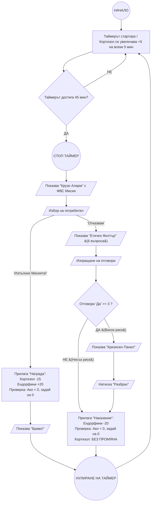

```mermaid
graph TD
    A((НАЧАЛО)) --> B[Таймерът стартира / Кортизол се увеличава +5 на всеки 5 мин];
    B --> C{Таймерът достига 45 мин?};
    C -- "НЕ" --> B;
    C -- "ДА" --> E((СТОП ТАЙМЕР));
    E --> F[/Показва &quot;Крузо Аларм&quot; с ФВС Мисия/];
    F --> G[/Избор на потребител/];
    G -- "'Изпълних Мисията!'" --> H[Прилага &quot;Награда&quot;:<br>Кортизол -15<br>Ендорфини +20<br>Проверка: Ако < 0, задай на 0];
    H --> I[/Показва &quot;Браво!&quot;/];
    I --> Z((НУЛИРАНЕ НА ТАЙМЕР));
    G -- "'Отказвам'" --> K[/Показва &quot;Етичен Филтър&quot; &#40;6 въпроса&#41;/];
    K --> L[/Изпращане на отговори/];
    L --> M{Отговори &apos;Да&apos; >= 3 ?};
    M -- "НЕ &#40;Нисък риск&#41;" --> N[Прилага &quot;Наказание&quot;:<br>Ендорфини -20<br>Проверка: Ако < 0, задай на 0<br>Кортизол: БЕЗ ПРОМЯНА];
    N --> Z;
    M -- "ДА &#40;Висок риск&#41;" --> O[/Показва &quot;Кризисен Панел&quot;/];
    O --> P[/Натиска &quot;Разбрах&quot;/];
    P --> N;
    Z --> B;
```
