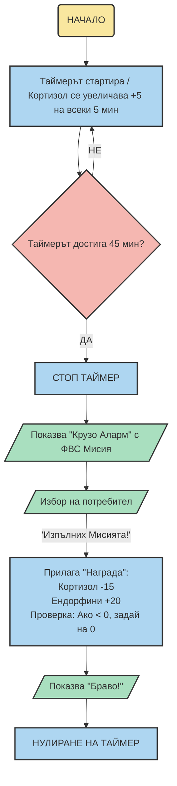

```mermaid
graph TD
    %% Дефиниции на цветовете (базирани на Екранна снимка 2025-10-26 171323.png)
    classDef startEnd fill:#f9e79f,stroke:#333,stroke-width:2px;
    classDef function fill:#aed6f1,stroke:#333,stroke-width:2px;
    classDef io fill:#a9dfbf,stroke:#333,stroke-width:2px;
    classDef condition fill:#f5b7b1,stroke:#333,stroke-width:2px;

    %% Начало
    A(НАЧАЛО) --> B[Таймерът стартира / Кортизол се увеличава +5 на всеки 5 мин];
    class A startEnd;
    class B function;

    %% Основен цикъл
    B --> C{Таймерът достига 45 мин?};
    class C condition;
    C -- "НЕ" --> B;
    C -- "ДА" --> E[СТОП ТАЙМЕР];
    class E function;

    %% Разклонение
    E --> F[/Показва &quot;Крузо Аларм&quot; с ФВС Мисия/];
    F --> G[/Избор на потребител/];
    class F,G io;

    %% Път 1: Изпълнение
    G -- "'Изпълних Мисията!'" --> H[Прилага &quot;Награда&quot;:<br>Кортизол -15<br>Ендорфини +20<br>Проверка: Ако < 0, задай на 0];
    H --> I[/Показва &quot;Браво!&quot;/];
    I --> Z[НУЛИРАНЕ НА ТАЙМЕР];
    class H function;
    class I io;
    class Z function;
```
